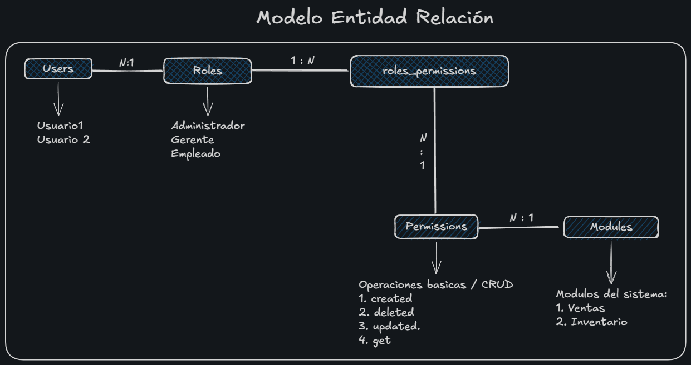

# 📋 Acerca de este proyecto

Este proyecto consiste en el diseño y estructuración de una Base de Datos Relacional para un Sistema de Gestión de Ventas e Inventario, optimizada para garantizar la integridad de los datos, la trazabilidad de las operaciones y la persistencia de información histórica.

El sistema está pensado para manejar el flujo completo de una transacción comercial: desde la catalogación de productos hasta el registro detallado de pagos y la auditoría de registros.

<br>

# 🛠️ Stack tecnológico
<div align="center">

  
  
  
  
  
  
  

</div>

<br>

# ⚙️ Arquitectura RBAC / MER

### 📑 Modelo Entidad-Relación (MER)

Si quieres ver las propiedades de las entidades, puedes ir a este sitio: [MER completo](https://dbdiagram.io/d/Auth-API-6994d895bd82f5fce2fc2687).

<div align="center">
  
</div>

### 🔑 Composición de los TOKENS (JWT)

**TOKEN ACCESS:**
```json
{
  "userID":"1",
  "roleId":"1",
  "iat": 1516239022,
  "exp": 1516242622,
  "TOKEN_ACCESS"=LA_Clave_que_TU_QUIERAS
}
```

**Json del cliente al logearse**
```json
{
  "userID":"1",
  "name":"jesus francisco cortez torres",
  "email":"jesus@gmail.com",
  "role":{
    "roleId":"1",
    "name":"administrador"
  },
  "permissions":[
    {
    "name_module":"inventario",
      "permissions":["read","update"]
    },
    {
    "name_module":"ventas",
      "permissions":["read","update","delete","create"]
    }
  ],
  "tokens": "ABCGDxs283..."
}
```

### ⌨️ Codigo de la Base de datos

Puedes ver el codigo de la base de datos [📍Aqui](https://github.com/RitoTorri/Sistema-Ventas-Backend/blob/main/database/DB.sql)

<br>

# 🌟 Características Especiales

* **RBAC Dinámico:** Control total basado en roles y permisos.
* **Auto-Seed de Permisos:** ⚡ Al registrar un nuevo módulo, el sistema vincula automáticamente los permisos de CRUD correspondientes en la DB.
* **Seguridad:** Implementación de CORS y Rate Limiting.

<br>

# 🔧 Configuración inicial

### 📦 Instalación:
```bash
# Clona el repositorio
git clone https://github.com/RitoTorri/Sistema-Ventas-Backend

# Entra al directorio
cd Sistema-Ventas-Backend

# Instala las dependencias
npm install
```

### ⚠️ Importante:
Si el proyecto es ejecutado de manera local, Recuerda crear la base de datos primero en PostgreSQL.

### 🔐 Variables de entorno (.env):
Debes renombrar `.env.example` a `.env` y configurar:

**Generales:**
- `PORT=` - Puerto de la aplicación
- `API_RATE_LIMIT_MAX` - Límite de peticiones por ventana de tiempo
- `API_RATE_LIMIT_WINDOW` - Ventana de tiempo (15 min en ms)
- `TOKEN_ACCESS` - Llave secreta para tokens JWT

**Base de datos:**
- `DB_HOST` - IMPORTANTE: usa el nombre del servicio Docker o localhost si se ejecuta en local
- `DB_PORT` - Puerto PostgreSQL
- `DB_NAME` - Nombre de la base de datos
- `DB_USERNAME` - Usuario
- `DB_PASSWORD` - Contraseña

**Frontend:**
- `FRONTEND_URL` - URL del frontend para CORS

<br>

# 🚀 Ejecución

### 🐳 En Docker (producción):
```bash
# SOLO PRODUCCIÓN
# Construir imagen
docker compose -f docker-compose.yml build

# Ejecutar contenedores
docker compose -f docker-compose.yml up
```

### 💻 En local (desarrollo):

```bash
# SOLO DESARROLLO
# Modo hot-reload
npm run start:dev
```

### 📄 Documentación

Para ver la documentación de la API REST, visite la siguiente URL:

```bash
http://localhost:PUERTO/docs
```
