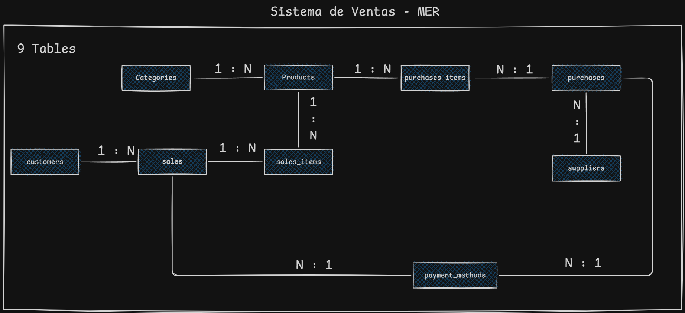

# 📋 Acerca de este proyecto

Este proyecto consiste en el diseño y estructuración de una Base de Datos Relacional para un Sistema de Gestión de Ventas e Inventario, optimizada para garantizar la integridad de los datos, la trazabilidad de las operaciones y la persistencia de información histórica.

El sistema está pensado para manejar el flujo completo de una transacción comercial: desde la catalogación de productos hasta el registro detallado de pagos.

<br>

# 🛠️ Stack tecnológico

<div align="center">


</div>

<br>

# ⚙️ Arquitectura RBAC / MER del sistema

### 📑 Modelo Entidad-Relación (MER)

<div align="center">
  
</div>

<div align="center">
  
</div>

### 🔑 Composición de los TOKENS (JWT)

**TOKEN ACCESS:**

```json
{
  "userID":"1",
  "roleId":"1",
  "iat": 1516239022,
  "exp": 1516242622,
  "TOKEN_ACCESS"=LA_Clave_que_TU_QUIERAS
}
```

**Json del cliente al logearse**

```json
{
  "userID": "1",
  "name": "JESUS FRANCISCO CORTEZ TORRES",
  "email": "jesus@gmail.com",
  "role": {
    "roleId": "1",
    "name": "administrador"
  },
  "permissions": [
    {
      "name_module": "inventario",
      "permissions": ["READ", "UPDATE"]
    },
    {
      "name_module": "ventas",
      "permissions": ["READ", "UPDATE", "DELETE", "CREATE"]
    }
  ],
  "token": "ABCGDxs283..."
}
```

### ⌨️ Codigo de la Base de datos

Puedes ver el codigo de la base de datos [📍Aqui](https://github.com/RitoTorri/Sistema-Ventas-Backend/tree/main/database/SQL)

<br>

# 🌟 Características Especiales

- **RBAC Dinámico:** Control total basado en roles y permisos para gestionar clientes, proveedores y usuarios.
- **Auto-Seed de Permisos:** ⚡ Al registrar un nuevo módulo, el sistema vincula automáticamente los permisos de CRUD correspondientes en la DB.
- **Seguridad:** Implementación de CORS y Rate Limiting para proteger los endpoints sensibles.
- **Gestión de Clientes:** Registro, actualización y seguimiento de clientes con datos de contacto y documentos.
- **Gestión de Proveedores:** Control de proveedores con RIF, datos de contacto y dirección fiscal.
- **Gestión de Usuarios:** Administración de usuarios del sistema con roles y permisos asignados.
- **Auditoría:** Registro de fechas de creación y actualización (created_at, updated_at, deleted_at).

<br>

# 🔧 Configuración inicial

### 📦 Instalación:

```bash
# Clona el repositorio
git clone https://github.com/RitoTorri/Sistema-Ventas-Backend

# Entra al directorio
cd Sistema-Ventas-Backend

# Instala las dependencias
npm install
```

### ⚠️ Importante:

Si el proyecto es ejecutado de manera local, Recuerda crear la base de datos primero en PostgreSQL.

### 🔐 Variables de entorno (.env):

Debes renombrar `.env.example` a `.env` y configurar:

| Variable | Descripción | Ejemplo |
|----------|-------------|---------|
| `PORT` | Puerto de la aplicación | `3000` |
| `API_RATE_LIMIT_MAX` | Cantidad máxima de peticiones por ventana de tiempo | `100` |
| `API_RATE_LIMIT_WINDOW` | Ventana de tiempo para rate limiting (ms) | `900000` |
| `TOKEN_ACCESS` | Llave secreta para tokens JWT | `tu_clave_secreta` |
| `POSTGRES_HOST` | Host de la base de datos | `localhost` |
| `POSTGRES_PORT` | Puerto de PostgreSQL | `5432` |
| `POSTGRES_USER` | Usuario de la base de datos | `postgres` |
| `POSTGRES_PASSWORD` | Contraseña de la base de datos | `postgres123` |
| `POSTGRES_DB` | Nombre de la base de datos | `sistema_ventas` |
| `PORCENTAGE_AUMENT_FOR_PURCHASE` | Porcentaje que se suma al precio del producto al comprar | `15` |
| `FRONTEND_URL` | URL del frontend para CORS | `http://localhost:3543` |

<br>

# 🚀 Ejecución

### 🐳 En Docker (producción):

```bash
# SOLO PRODUCCIÓN
# Construir imagen
docker compose build

# Ejecutar contenedores
docker compose up
```

### 💻 En local (desarrollo):

```bash
# SOLO DESARROLLO
# Modo hot-reload
npm run start:dev
```

### 📄 Documentación

Para ver la documentación de la API REST, visite la siguiente URL:

```bash
http://localhost:PUERTO/docs
```
