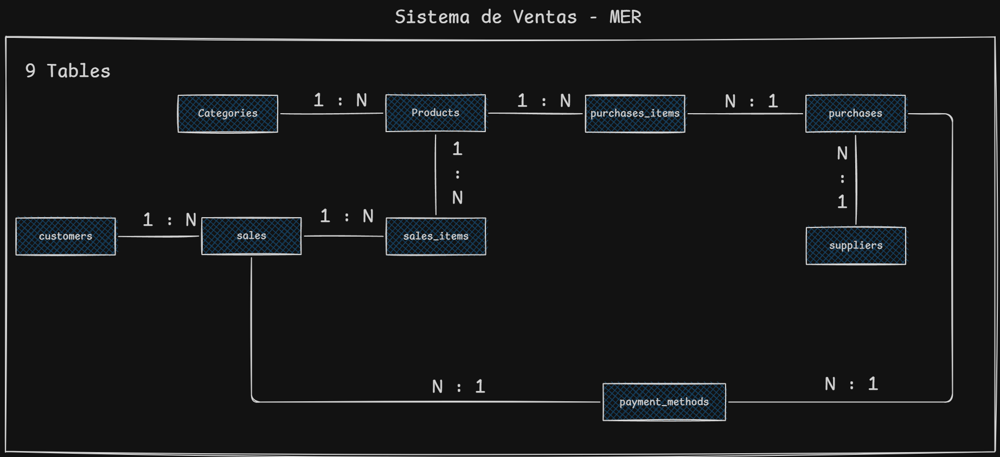

# 🛒 Sistema de Ventas e Inventario (Backend)

- [Acerca de este proyecto](#️-acerca-de-este-proyecto)
- [Stack tecnológico](#️-stack-tecnológico)
- [Arquitectura RBAC / MER del sistema](#️-arquitectura-rbac--mer-del-sistema)
- [Instalación](#-instalación)
- [Configuración inicial](#-configuración-inicial)
- [Guía de inicio rápido](#-guía-de-inicio-rápido)
- [Usuario administrador](#-usuario-administrador)
- [Documentación](#-documentación)

<br>

# 📖 Acerca de este proyecto

Este proyecto consiste en el diseño e implementación de una **Base de Datos Relacional** y una **API REST** para un Sistema de Gestión de Ventas e Inventario. Está optimizada para garantizar la integridad de los datos, la trazabilidad total de las operaciones y la persistencia de la información histórica.

El sistema abarca el flujo completo de una transacción comercial: desde la catalogación de productos hasta el registro detallado de pagos.

### 🚀 Características principales

#### 🔐 Seguridad y control de acceso
- **Autenticación JWT** – Tokens seguros para proteger endpoints y gestionar sesiones.
- **RBAC dinámico** – Control de acceso basado en roles y permisos granulares (usuarios, clientes, proveedores, módulos).
- **Rate limiting + CORS** – Protección avanzada contra ataques y configuración de orígenes permitidos.

#### 🧩 Mantenibilidad y productividad
- **Auto-seed de permisos** – Al registrar un nuevo módulo, el sistema vincula automáticamente los permisos CRUD necesarios.
- **Documentación Swagger** – API completamente documentada e interactiva para pruebas e integración.
- **Inicialización automatizada** – Script que prepara BD y entorno tanto en desarrollo como en producción.

#### 🛒 Gestión comercial completa
- **Ventas y compras** – Endpoints para registrar, consultar y actualizar transacciones.
- **Inventario y productos** – CRUD de productos, categorías y métodos de pago.
- **Clientes y proveedores** – Registro, actualización y seguimiento con validaciones de datos.
- **Usuarios y roles** – Administración completa de usuarios, roles y permisos asignados.

#### 📝 Auditoría y trazabilidad
- **Registro automático** – Campos `created_at`, `updated_at` y `deleted_at` en todas las entidades principales.

<br>

# 🛠️ Stack tecnológico

<div align="center">


</div>

<br>

# ⚙️ Base de datos del Sistema de Ventas e Inventario

Puedes ver el codigo de la base de datos [📍Aqui](https://github.com/RitoTorri/Sistema-Ventas-Backend/tree/main/database/SQL)

### 🎭 Modelo entidad-relación de la arquitectura RBAC

<div align="center">
  
</div>

### 📊 Modelo Entidad-Relación (MER)

<div align="center">
  
</div>

### 🔑 Composición de los TOKENS (JWT)

Este sistema utiliza JWT para autenticar y autorizar las peticiones. Cada petición recibe un token JWT que contiene información sobre el usuario y su permisos. El token se genera automáticamente al inicar sesión.

**Composición del TOKEN ACCESS:**

```json
{
  "userID":"1",
  "roleId":"1",
  "iat": 1516239022,
  "exp": 1516242622,
  "TOKEN_ACCESS":clave_secreta
}
```

<br>

# 📦 Instalación:

```bash
# Clona el repositorio
git clone https://github.com/RitoTorri/Sistema-Ventas-Backend

# Entra al directorio
cd Sistema-Ventas-Backend
```

<br>

# 🔧 Configuración inicial

### 🔐 Variables de entorno (.env):

Debes renombrar `.env.example` a `.env` y configurar:

| Variable | Descripción | Ejemplo |
|----------|-------------|---------|
| `PORT` | Puerto de la aplicación | `3000` |
| `API_RATE_LIMIT_MAX` | Cantidad máxima de peticiones por ventana de tiempo | `100` |
| `API_RATE_LIMIT_WINDOW` | Ventana de tiempo para rate limiting (ms) | `900000` |
| `TOKEN_ACCESS` | Llave secreta para tokens JWT | `tu_clave_secreta` |
| `POSTGRES_HOST` | Host de la base de datos | `localhost` |
| `POSTGRES_PORT` | Puerto de PostgreSQL | `5432` |
| `POSTGRES_USER` | Usuario de la base de datos | `postgres` |
| `POSTGRES_PASSWORD` | Contraseña de la base de datos | `postgres123` |
| `POSTGRES_DB` | Nombre de la base de datos | `sistema_ventas` |
| `PORCENTAGE_AUMENT_FOR_PURCHASE` | Porcentaje que se suma al precio del producto al comprar | `15` |
| `FRONTEND_URL` | URL del frontend para CORS | `http://localhost:3543` |

<br>

# 🚀 Guía de inicio rápido

Este proyecto incluye scripts de inicialización que configura la base de datos y arranca el servidor.  
**Su comportamiento varía según el entorno:**

- En **modo desarrollo**, solo debe ejecutarse **una vez** para preparar la base de datos.
- En **modo producción** (Docker), el script se ejecuta automáticamente al levantar los contenedores.

### 🐳 Docker (producción)

Sigue estos pasos para levantar el proyecto con Docker:

```bash
# Construir la imagen
docker compose build

# Levantar los contenedores
docker compose up
```

### 💻 Entorno local (desarrollo)

**Es recomendado que se ejecute solo una vez**. Para configurar el proyecto de manera local, ejecuta los siguientes comandos:

```bash
# Entra al directorio
cd Sistema-Ventas-Backend

# instala las dependencias
npm install

# Ejecutar el seeding de la base de datos
./init_db_local.sh

# Ejecutar el servidor con hot-reload
npm run start:dev
```

### 📌 Explicación de los scripts

- `init_db_local.sh`: Este escript se encarga de crear la base de datos en caso de que no exista y ejecuta los archivos SQL de la ruta `/src/database/SQL` para crear los enums, tablas, views y functions necesarios para que el codigo funcione. Además, ejecuta el seeding de la base de datos para crear los roles, permisos y el usuario administrador.
- `init_db_docker.sh`: Ejecuta el seeding de la base de datos para crear los roles, permisos y el usuario administrador.

<br>

# 👨‍💼 Usuario Administrador

El usuario administrador se crea en los scripts de inicialización, Las credenciales del usuario administrador son:

| Usuario | Contraseña |
|---------|------------|
| admin@admin.com   | admin      |

<br>

# 📄 Documentación

Para ver la documentación de la API REST, visite la siguiente URL:

```bash
http://localhost:PUERTO/docs
```
